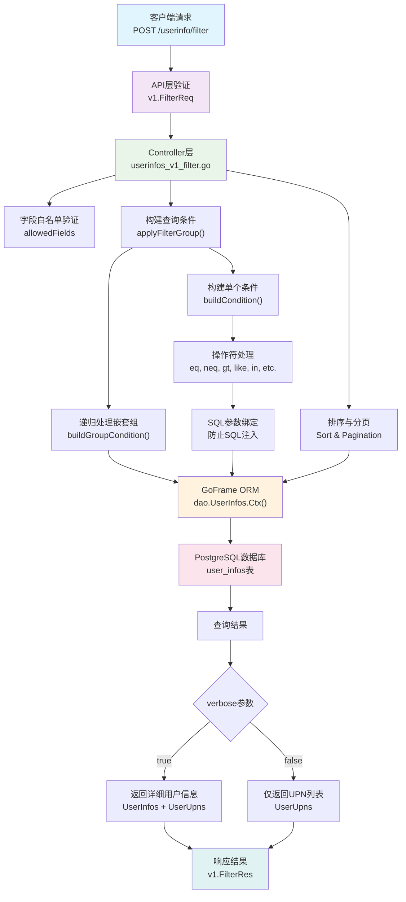

# 需求文档
1. ITTools -> userinfos
- 指定upn，查询用户详情
- filter，根据指定规则，过滤出符合规则的所有用户的upn/详细信息。
- 同步。sync.py CronJob

2. quota pool。用户钱包。用户组管理。配额池管理。
- 只有配额池的概念
- 配额池Quota Pool 有 刷新周期、定期配额、剩余配额、上次刷新时间、加油包。还有一个动态计算的：余额=剩余配额+加油包。（约定，刷新周期 < 0 时不刷新）
- 个人余额取消，每个人拥有自己的一个quota pool
- 字段：disabled。例如学生自己的配额池，开启disabled。
- 字段：personal 用来记录是否是用户默认自带的、自己的配额池（区别去手动创建的配额池）
- userinfos 规则需要在配额池里面声明。
- quota pool对应的casbin里面的角色声明可以使用的功能。
- 创建quota pool流程：
    1. 每个人自带一个自己的quota pool，为自动创建
    2. 需要有批量操作quota pool属性的接口和界面
    3. 其他配额池、科研组申请的配额池，为手动创建quota pool，并配置配额池的userinfos规则，滤出对应的upn，并在casbin中新建角色，并完成g，upn，quota_pool 的角色继承设置。

3. Casbin Auth模块，管理鉴权。
g, upn, student-pool
- 接口：动态获取用户属于哪些用户组，可以用什么模型。
- 接口：查询一个配额池有哪些用户，可以用什么模型。
- 接口：基础权限查询。r = sub, dom, obj, act
- 接口：权限查询解释。用于管理。
- 接口、权限：一键关闭一些权限policy（关小黑屋）
- 对话前端：更改用户组的时候，需要请求获取用户组可用的模型。

- uniauth 前后端的权限管理
p, sub, dom, obj, act
p, my upn, 'dom', uniauth/bill/quota_pool_name, read  // 可以有查看quota_pool_name配额池的消费记录
obj里面有uniauth的，有权限的，则可以进入平台

4. Config配置中心，动态增减模型，动态i18n。
- 动态模型配置。前端需要一个编辑界面来完成。后端也要接口。
- i18n配置。前端需要一个编辑界面来完成。后端也要接口。

5. Billing计费。账单导出。
- Check Balance接口。后端扣费时检验用户和配额池关系，再检查配额池情况。如果没有配额池，直接报错（返回不存在）。
    1. 先看看是否要刷新，懒刷新。
    2. 如果有配额池，但是对应的钱没有了，返回token not enough。
    3. 需要返回o不ok。返回这个钱包的余额百分比。返回报错原因/报错码
    4. 这个接口用于： 对话后端查询能不能用这个模型。
    5. 需要传递：upn，approach_id, quota_pool
    6. 对话前端：所有人的剩余用量的进度条删除。
- 对话前端界面：Check Tokens Usage，还是传游戏币，根据真的cost来。
- 计费接口
- uniauth前端：能够让配额池管理员等查看特定配额池的消费记录。可以自己增减团队成员。不可以出账。
- 出单功能：
    1. 出单指 配额池 的出单。
    2. 出单时 可以选择特定的一些条目出单。svc=chat product=approach_id 时间区间。可以多选。出PDF或者Excel。
        - remark：字段放每次approach_id对应的详细的模型调用、tool call、chat_session_id、msg_idx等详细信息。JSON格式，任意内容。可以选择要不要出详情。
        - 放在PDF里面：remark 放在文件的末尾作为备注。
        - 放在Excel里面：remark 直接放在最右边一列。
    3. 必须是IT出单。
    