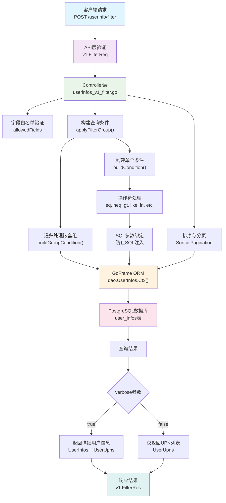

```mermaid
graph TD
    A["客户端请求<br/>POST /userinfo/filter"] --> B["API层验证<br/>v1.FilterReq"]
    B --> C["Controller层<br/>userinfos_v1_filter.go"]
    
    C --> D["字段白名单验证<br/>allowedFields"]
    C --> E["构建查询条件<br/>applyFilterGroup()"]
    C --> F["排序与分页<br/>Sort & Pagination"]
    
    E --> G["递归处理嵌套组<br/>buildGroupCondition()"]
    E --> H["构建单个条件<br/>buildCondition()"]
    
    H --> I["操作符处理<br/>eq, neq, gt, like, in, etc."]
    I --> J["SQL参数绑定<br/>防止SQL注入"]
    
    G --> K["GoFrame ORM<br/>dao.UserInfos.Ctx()"]
    J --> K
    F --> K
    
    K --> L["PostgreSQL数据库<br/>user_infos表"]
    L --> M["查询结果"]
    
    M --> N{"verbose参数"}
    N -->|true| O["返回详细用户信息<br/>UserInfos + UserUpns"]
    N -->|false| P["仅返回UPN列表<br/>UserUpns"]
    
    O --> Q["响应结果<br/>v1.FilterRes"]
    P --> Q
    
    style A fill:#e1f5fe
    style B fill:#f3e5f5
    style C fill:#e8f5e8
    style K fill:#fff3e0
    style L fill:#fce4ec
    style Q fill:#e0f2f1
```